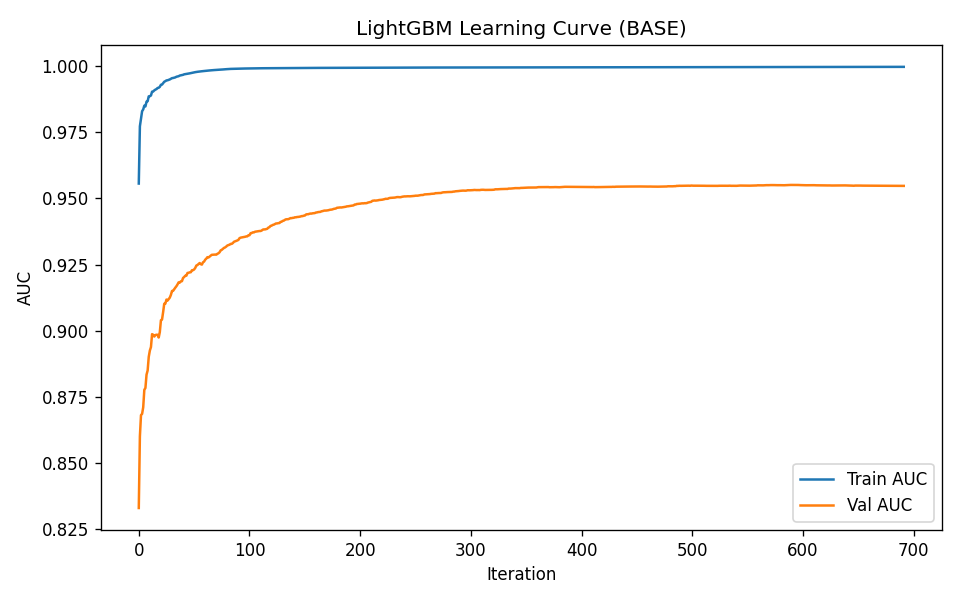
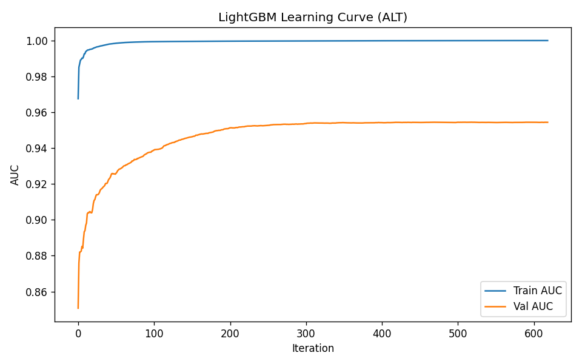

# Fraud Detection using Machine Learning
Focused on imbalanced classification and decision-oriented model evaluation.
Data informs; decisions define. Building ML systems for real-world decision making.

This project implements an end-to-end machine learning pipeline for fraud detection using the Bank Account Fraud (BAF) dataset. The focus is on handling highly imbalanced data and optimizing model performance under realistic constraints.

---

## Problem Context

Fraud detection is a highly imbalanced classification problem (~1% fraud cases).  
A model that maximizes accuracy can still fail in practice.

The goal is to detect fraudulent transactions early while controlling false positives, which directly impact user experience and operational costs.

---

## My Contributions

- Designed and implemented the data cleaning pipeline:
  - Outlier detection using IQR-based filtering
  - Feature transformations (Yeo-Johnson, log scaling)
  - Missing value handling and imputation
  - One-hot encoding for categorical variables

- Developed and trained the LightGBM model:
  - Implemented training pipeline using LightGBM
  - Applied imbalance handling (SMOTE / oversampling)
  - Selected classification threshold based on 5% False Positive Rate (FPR)

- Evaluated model performance:
  - Metrics: AUC, Recall, F1-score, Accuracy
  - Confusion matrix analysis
  - Learning curve generation and interpretation

---

## Pipeline

Raw Data → Cleaning → Feature Processing → Model → Evaluation

---

## Model

- LightGBM (Gradient Boosted Trees)
- Early stopping based on validation performance
- Evaluation based on AUC and Recall under constrained FPR

---

## Key Technical Decisions

- **Imbalanced Data Handling**  
  Fraud cases represent ~1% → standard training leads to bias toward non-fraud.  
  Solution: SMOTE / oversampling applied only on training data.

- **Threshold Optimization (5% FPR)**  
  Instead of default threshold (0.5), the model selects a threshold based on validation data to control false positives.  
  This reflects real-world deployment constraints.

- **Metric Selection**  
  Accuracy is misleading → AUC and Recall are prioritized for evaluation.

---

## Results

From test evaluation:

- **AUC:** 0.9540  
- **Accuracy:** 0.9424  
- **F1-score:** 0.2271  
- **Recall @ 5% FPR:** 0.7711  

### Interpretation

- High AUC indicates strong discrimination between fraud and non-fraud cases  
- High recall under constrained FPR shows effective detection while limiting false alarms  
- Low F1-score reflects class imbalance (expected in fraud problems)

---

## Learning Curves

### Base Model


### Alternative Model


### Insights

- Training AUC approaches 1.0 → model has high capacity  
- Validation AUC stabilizes ~0.95 → good generalization  
- Gap between train and validation suggests mild overfitting but acceptable performance

---

## How to Run

1. Install dependencies:
```bash
pip install -r requirements.txt
```
2. Download dataset from Kaggle:

     https://www.kaggle.com/datasets/sgpjesus/bank-account-fraud-dataset-neurips-2022

3. Prepare data (clean + split):
```bash
python run.py --mode clean --datacsv path/to/dataset.csv
python run.py --mode prepare --datacsv cleandata/dataset_clean.csv
```
4. Run model:
```bash
python run.py --mode lgbm --preparedpath prepared_data/prepared_base --resampler smote
```
>Note: The prepared_data folder is generated after running the preparation stage.
